# MCP, Embeddings and Descending into AI Hell
*A Technical Deep-Dive for the Immortally Curious*

---

## Introduction
*Welcome, creatures of the night...*


---

## What is MCP (Model Context Protocol)?
*The modern blood pact between AI and applications*

Imagine you're an ancient vampire trying to use modern technology. You want your AI assistant to help you manage your centuries-old wine collection, track your various identities across different eras, and maybe help you write convincing cover letters for night shift jobs. But here's the problem: your AI lives in one world, and all your important stuff lives scattered across different apps, files, and systems.

MCP solves this eternal struggle by creating a bridge between AI and the digital world around it.

### Why Do We Need MCP?

- **Your AI is isolated**: Like a vampire trapped in a coffin, AI models can only work with what you directly tell them. They can't peek into your photo library, read your emails, or check your calendar

- **Everything is scattered**: Your digital life is spread across dozens of apps - photos in one place, documents in another, your Spotify playlists somewhere else entirely

- **Manual work is tedious**: Without MCP, you'd have to copy and paste everything manually, like transcribing ancient scrolls by candlelight every single time

- **Context gets lost**: When you switch between conversations or apps, your AI forgets everything - imagine if you had to reintroduce yourself to your flatmates every single night

- **No real-time help**: Your AI can't actually *do* things for you - it's like having an incredibly knowledgeable butler who can only give advice but never actually fetch your cape

MCP changes all of this by letting your AI assistant actually connect to and interact with your apps and data, making it truly useful rather than just a fancy search engine.

---

## MCP Architecture: The Bridge Between Worlds
*"How your AI escapes its digital coffin"*

```mermaid
---
config:
  layout: dagre
---
flowchart TB
 subgraph subGraph0["Your Digital Crypt"]
        AI["🧛‍♂️ Claude"]
        MCP["MCP Protocol"]
  end
 subgraph subGraph1["Local MCP Servers 🏠"]
        FS["📁 File System"]
        NOTES["📝 Notes App"]
        CAL["📅 Calendar"]
  end
 subgraph subGraph2["Remote MCP Servers 🌐"]
        SLACK["💬 Slack"]
        WEATHER["🌤️ Weather API"]
        SPOTIFY["🎵 Spotify"]
  end
    AI -.-> MCP
    MCP --> FS & NOTES & CAL
    MCP -. API Keys .-> SLACK
    MCP -. OAuth .-> WEATHER
    MCP -. Bearer Tokens .-> SPOTIFY
    SLACK --> CLOUD["☁️ The Eternal Cloud"]
    WEATHER --> CLOUD
    SPOTIFY --> CLOUD
    style AI fill:#8b0000,stroke:#fff,color:#fff
    style MCP fill:#4a0080,stroke:#fff,color:#fff
    style FS fill:#2d4a2d,stroke:#fff,color:#fff

```




**The beautiful simplicity:**
- **Local MCP Servers** run on your machine - direct access to your files, databases, local apps
- **Remote MCP Servers** connect through APIs - your GitHub repos, Slack workspace, bank accounts
- **One Protocol** to rule them all - Claude speaks MCP, everything else translates
- **Security layers** - each connection type uses appropriate authentication (OAuth, API keys, etc.)

Think of MCP as the universal translator that turns your AI from an isolated hermit named Petyr into a well-connected digital vampire with access to everything in your digital realm.

---


---

## MCP in Action: Flat Life Coordination
*"Finally, a way to organize nocturnal chaos"*

Living with other vampires in Wellington? You know the struggle. Everyone's got different schedules, feeding preferences, and that one flatmate who insists on "ethical sourcing" while another goes full goth tourist in the local clubs.

**The eternal flatmate problems:**
- Coordinating group activities around 5 different sleep schedules
- Managing the shared blood bank inventory (and whose turn it is to restock)
- Planning Wellington adventures that avoid all the sunny spots
- Keeping track of who's using which identity for the power bills
- Organizing flat meetings when everyone's actually awake
- Making sure the blackout curtains are properly maintained

**The old way (pure chaos):**
- WhatsApp group chat with 247 unread messages
- Sticky notes on the fridge that fall off
- "I thought you said Tuesday" arguments at 3am
- Someone always double-books the good hunting grounds
- The blood bank runs out right when you need it most

**With MCP, you ask:**
*"Claude, coordinate this week's flat schedule. Check everyone's calendars, find times when we're all awake, book our usual table at that 24-hour café, update our shared shopping list based on current blood bank inventory, and send reminders about the Wellington vampire meetup on Friday."*

**What MCP does:**
- Accesses everyone's shared calendars and finds overlapping free time
- Checks your flat's shared inventory management app
- Books restaurants and venues through their APIs
- Updates shared shopping lists and assigns tasks
- Sends personalized calendar invites with optimal travel routes (avoiding sunny streets)
- Cross-references weather forecasts to suggest indoor backup plans

**Result:** Your flat actually functions like civilized immortals instead of a chaotic crypt. Revolutionary.

---

## MCP in Action: Building a Memory Bank
*"Remember when I told you about that thing 200 years ago?"*

You know what's frustrating about being immortal? Having centuries of experiences but your AI assistant has the memory of a goldfish. Every conversation starts from scratch, like you're meeting for the first time.

**The problem with AI amnesia:**
- "Remember when I mentioned my investment strategy from the 1800s?" *...blank stare*
- "You helped me plan that heist in Prague last century" *...who are you again?*
- "We discussed my complicated relationship with the Wellington werewolf pack" *...wolves? what wolves?*

**Enter: The Memory Bank MCP Server**

Imagine having an AI that actually *remembers* your conversations - not just word-for-word transcripts, but the *meaning* and *context* of what you've discussed.

**Setting up semantic memory retrieval:**

```json
{
  "mcpServers": {
    "memory-bank": {
      "command": "memory-bank-server",
      "args": ["--semantic-search", "--long-term-storage"]
    }
  }
}
```

**Encouraging semantic memory retrieval:**
Add checklists for your assistant to follow before and after a task. 
Do this in a system prompt if possible.
```markdown
- Whenever the user asks a question or gives a task, check the memory bank for relevant past conversations and context.
- When you think you have finished a task, always follow the checklist at ./task_completion_checklist.md
```

**What happens behind the scenes:**
- Every conversation gets converted into *semantic fingerprints*
- Important details are stored not just as exact text, but as *meaning patterns*
- When you start a new conversation, the AI instantly recalls relevant context
- "Oh right, you're the vampire who invested in railway stocks and has trust issues with werewolves"

**Real conversation flow:**

*You:* "I'm thinking about that investment opportunity we discussed"

*AI:* *[Searches memory bank semantically]* "Ah yes, the cryptocurrency mining operation in Iceland. You were concerned about the environmental impact conflicting with your 'eternal stewardship' philosophy. You also mentioned it reminded you of the tulip mania you witnessed in 1637."

**The magic ingredient?** This semantic search doesn't just match keywords - it understands *meaning*. When you mention "trust issues," it knows you're probably referencing your complicated history with shapeshifters, not your general anxiety about banks.

This memory persistence transforms your AI from a helpful stranger into something closer to a centuries-old confidant who actually *knows* you.

But how does the AI understand *meaning* rather than just matching words? That's where we dive into the mathematical sorcery of...

---

## Understanding Embeddings
*Converting thoughts into numerical essence*

You know how when you walk into a room, you can instantly sense the "vibe"? Whether it's a cozy coffeehouse, a pretentious art gallery, or a blood bank with questionable hygiene standards? That intuitive understanding of similarity and difference is exactly what embeddings give to computers.

### What Are Embeddings, Really?

Imagine you're describing every person you've met over your centuries of existence. Instead of writing lengthy descriptions ("tall, dark, brooding, probably owns too many leather jackets"), what if you could capture someone's entire essence as a list of numbers?

That's an embedding - a mathematical fingerprint that captures the *meaning* of something as a list of numbers. Words, sentences, entire documents, even images and sounds - all converted into numerical coordinates in an abstract space.

### The 2D Intuition: Personality Mapping

Let's start simple. Imagine mapping vampire personalities on a 2D chart:


### Calculating Similarity: The Math Behind the Magic

**Distance formula** (how different they are):
```
Distance = √[(x₂-x₁)² + (y₂-y₁)²]

Bookish ↔ Old Money = √[(1-2)² + (2-3)²] = √[1 + 1] = 1.41
Bookish ↔ Punk = √[(8-2)² + (9-3)²] = √[36 + 36] = 8.49
```

**Similarity score** (closer = more similar):
- Bookish Scholar & Old Money Elite: Very similar (distance: 1.41)
- Bookish Scholar & Rebellious Punk: Very different (distance: 8.49)

### The Dimensional Explosion: From 2D to 384D

*"But wait,"* you say, *"vampire personalities are way more complex than just two traits!"*

Exactly! Real language embeddings use hundreds of dimensions to capture meaning:

**What if we tracked 384 different aspects?**
- Dimension 1: Formal ↔ Casual language
- Dimension 2: Emotional ↔ Analytical tone  
- Dimension 3: Past ↔ Future focused
- Dimension 4: Abstract ↔ Concrete concepts
- Dimension 5: Positive ↔ Negative sentiment
- ... (379 more dimensions)
- Dimension 384: Certainty ↔ Uncertainty

**In 384-dimensional space:**
- Each word gets 384 numbers: `[0.2, -0.7, 0.9, 0.1, ...384 values]`
- "Blood" might be: `[formal=0.1, emotional=0.8, past=0.2, concrete=0.9, negative=0.3, ...]`
- "Plasma" might be: `[formal=0.9, emotional=0.1, past=0.1, concrete=0.9, negative=0.0, ...]`

**The magic:** Words with similar *meanings* end up with similar coordinate patterns, even if they're spelled completely differently.

**NOTE:** We usually don't label the dimensions!

### Why This Matters for Your Memory Bank

Remember our Memory Bank MCP server? Here's how embeddings make semantic search possible:

**Old conversation:** *"I'm worried about the werewolf pack's territorial expansion affecting our hunting grounds."*

**Embedding captures the meaning as:**
- High values for: [conflict, territory, concern, supernatural, group-dynamics]
- Low values for: [romance, technology, historical, individual, celebration]

**Later, you ask:** *"What did we discuss about those shapeshifter boundary issues?"*

**This gets embedded as:**
- High values for: [conflict, territory, concern, supernatural, boundaries]
- Similar pattern to your earlier conversation!

**The AI finds the match** not because you used the same words ("werewolf" vs "shapeshifter"), but because the *meaning* patterns are mathematically similar in 384-dimensional space.

### The Beautiful Complexity

With 384 dimensions, embeddings can distinguish between:
- "I love this blood type" (positive sentiment, preference)
- "This blood type is love" (metaphorical, abstract)
- "Love, this blood type is..." (addressing someone, descriptive)

**Each gets a unique fingerprint** in mathematical space, allowing for incredibly nuanced understanding of language, context, and meaning.

This is how your AI assistant evolves from a simple pattern matcher into something that can understand context, nuance, and the subtle implications of centuries of vampire experience.

The next time your Memory Bank MCP server instantly understands that your question about "feeding ethics" relates to your previous discussions about sustainable hunting practices, blood bank regulations, and your philosophical evolution over the centuries - you'll know it's because embeddings turned your complex thoughts into mathematical poetry that computers can finally comprehend.

---

## The Architecture of AI Hell: Diminishing Returns Edition
*Where good intentions meet computational reality*


## Start Cheap, Get Desperate Slowly

Getting something semi-decent is probably a lot easier than you think. 
Getting something good is probably a lot harder than you think. 

**The Golden Rule:** Always climb from the top of the complexity staircase

**The Complexity Paradox:** Simple solutions feel "too easy" so we skip them for complex ones. 

**The Law of Diminishing Sanity:** Each step down the staircase costs 10x more but delivers 2x less improvement. Do the math before you do the deed.

**Prompt Engineering is Your Friend:** That "simple" text tweak might solve your problem for $0.02 instead of $20,000 in training costs. Try it first, try it hard, try it seventeen different ways.

**Context is Cheaper Than Compute:** Adding relevant context to your prompts costs pennies. Training a model from scratch costs your firstborn child and three months of your (admittedly potentially infinite) life.

---

## Lessons from the Abyss
*What we can learn in AI Hell*


### The Great Divide: When Developers and Domain Experts Can't See Eye to Eye
*"Like vampires and werewolves trying to plan a dinner party"*

After some degree of AI project carnage, I've discovered (multiple times) the most dangerous monster isn't faulty code or broken models - it's the communication chasm between two critical groups:

**The Developers:** These are your technical vampires. They have a deep understanding of what's *possible*.

**The Domain Experts:** These are your wise elders who actually know what *good* looks like. 

**The Problem?** 
The domain experts need to be able to experiment with AI capabilities, but don't have the right tools.
The developers are eager to build something great, but can't judge the results.

### Let's just keep it visual

This is **MUCH** easier said than done. 

I know _exactly_ where I want to go, but how do I get there?


Playing Polybridge is easy and fun, but the structures won't 'fly' in the real world.


After 700 years on this earth, I still don't think I'm smart enough to play Kerbal Space Program.

Imagine something that is simple enough to use, but complex enough to build anything you want. I can't. I still tried.

### Where MCP Changes Everything
*"Finally, speaking the same language"*

Here's where MCP fundamentally shifts the game. Instead of forcing domain experts to learn technical interfaces, MCP lets them communicate with AI in natural language while automatically handling all the technical complexity behind the scenes.

#### Before MCP:
*Vampire Elder:* "I need to figure out why our flat's feeding schedule keeps causing conflicts. Can you cross-reference everyone's hunting preferences with Wellington's nightlife patterns, plus check which territories are claimed by other supernatural groups..."

*Developer:* "Okay, so you want me to build a preference mapping system with geospatial analysis, connect it to social media APIs for event tracking, add supernatural territory databases, create conflict prediction algorithms..."

*Vampire Elder:* "Um... I just want to know why everyone's hangry at 2am on weekends."

*Developer:* "Right, so first we need to define what constitutes 'optimal feeding conditions'..."

#### With MCP:
*Vampire Elder:* "Claude, analyze our flat's feeding conflicts. Cross-reference everyone's hunting preferences with Wellington's weekend nightlife patterns, check territorial boundaries with other supernatural groups, and tell me when we're stepping on each other's toes."

*AI:* "I'll access your shared calendar data, analyze Wellington event schedules, cross-reference supernatural territory maps, and identify scheduling conflicts. Give me a moment..."

**[Two minutes later, comprehensive analysis complete with optimal feeding rotation schedule]**

### The Context Timidity Problem
*"When domain experts don't ask for enough"*

Without a clear grounding on what is possible, domain experts are *too modest* in their requests. 
Remember, context is king. We need more context, 
but developers are usually the ones who have intuition about what context is available and how to access it.

**Example from our flat's supernatural diplomacy crisis:**

*What vampire flatmates initially asked for:* "Just help us figure out why the werewolf pack is annoyed with us."

*What they actually needed:* "Analyze recent territorial incidents, cross-reference our hunting patterns with werewolf patrol schedules, check historical precedents from similar conflicts, identify which specific flatmate behaviors triggered the tension, review our diplomatic correspondence history, and suggest a peace offering that aligns with both our feeding needs and their territorial claims."

**Why the timidity?** Because in the pre-MCP world, each additional requirement meant weeks more development time, more complex interfaces, more things that could break. Domain experts learned to ask for less rather than deal with technical complexity.

**With MCP, the conversation changes:**

*Vampire Elder:* "Claude, I need to understand this werewolf pack tension..."

*AI:* "I can access your flat's incident logs, Wellington supernatural territory databases, and historical conflict records. Would you like me to also analyze your recent hunting patterns, check for overlapping territorial claims, review past diplomatic solutions, and draft a formal apology letter?"

*Vampire Elder:* "Yes! And can you also check if any of our recent 'recruits' have previous beef with this particular pack?"

*AI:* "Already on it. I'll cross-reference supernatural background checks and social network analysis."

Suddenly, domain experts aren't afraid to ask for comprehensive analysis because the technical complexity is completely hidden.

### What This Means for Future AI Projects
*"The post-MCP world"*

**1. The End of the Translation Layer**
No more meetings where developers try to translate business requirements into technical specifications. Domain experts can directly communicate with AI systems that understand context, nuance, and implication.

**2. Experimentation Without Developer Bottlenecks**
Domain experts can test ideas, iterate on approaches, and refine their requirements in real-time. No more "file a ticket and wait three weeks for the next iteration."

**3. Context-Rich by Default**
When accessing additional context is as simple as asking for it, domain experts will naturally request more comprehensive analysis. The AI workflows will become richer and more valuable by default.

**4. Failure Becomes Cheap**
Bad ideas fail fast and cheaply. Instead of spending months building the wrong system, domain experts can discover what doesn't work in minutes and pivot immediately.

**5. The Rise of AI Literacy**
Domain experts will naturally develop better AI collaboration skills because they can experiment directly without technical barriers. They'll learn what AI is good at, what it struggles with, and how to craft better requests.

### The Real Revolution
*"It's not about the technology, it's about who gets to use it"*

MCP isn't just a technical protocol - it's a democratization tool. It moves AI capabilities from the exclusive domain of developers into the hands of the people who actually understand the problems worth solving.

---

## Q&A
*Questions from the crypt*

---

## Thank You
*May your vectors be dense and your contexts be rich*

---

*Presentation prepared for the Wellington Vampire Collective*
*"Living forever means having time for proper technical deep-dives"*
